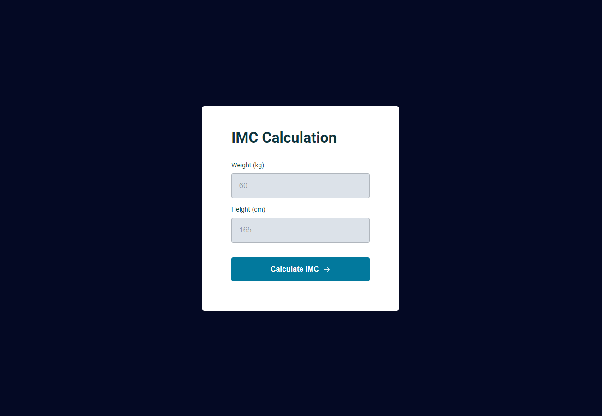

# 💻 Projeto: IMC calculator (Calcular IMC)

 

## 📌 Sobre o Projeto

Projeto desenvolvido no programa Explorer da Rocketseat para calcular o índice de Massa Corpórea.

Assuntos importantes aplicados: 

  * ES6 Modules
  * Modal
  * Manipulação da DOM

Figma: https://www.figma.com/file/4yyWRT8s9eYSVvBWIQeA9W/IMC-(Copy)?node-id=6%3A4

 

## 📌 Tecnologias 

Esse projeto foi desenvolvido com as seguintes tecnologias:

* HTML
* CSS
* JavaScript

 

## 📝 Licença

Esse projeto está sob a licença MIT. Veja o arquivo [LICENSE](LICENSE) para mais detalhes.

 
 

<h4 align="center">
    Por Rodrigo de Morais 🚀
</h4>